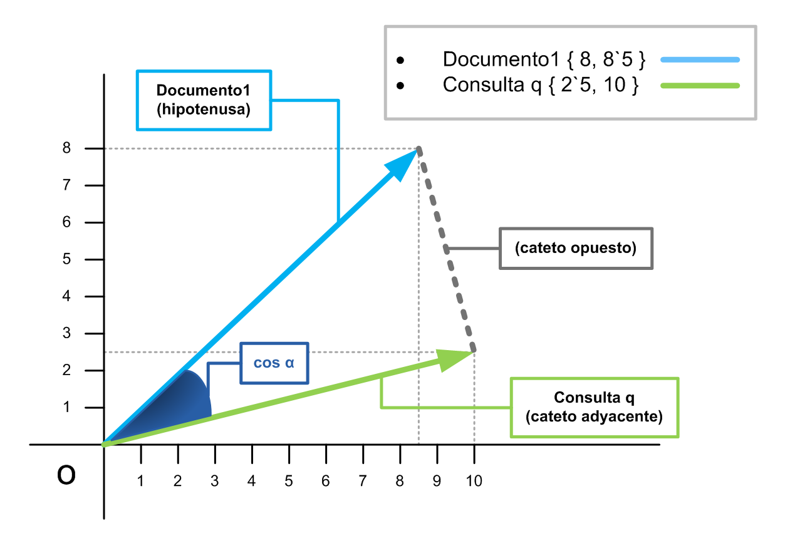
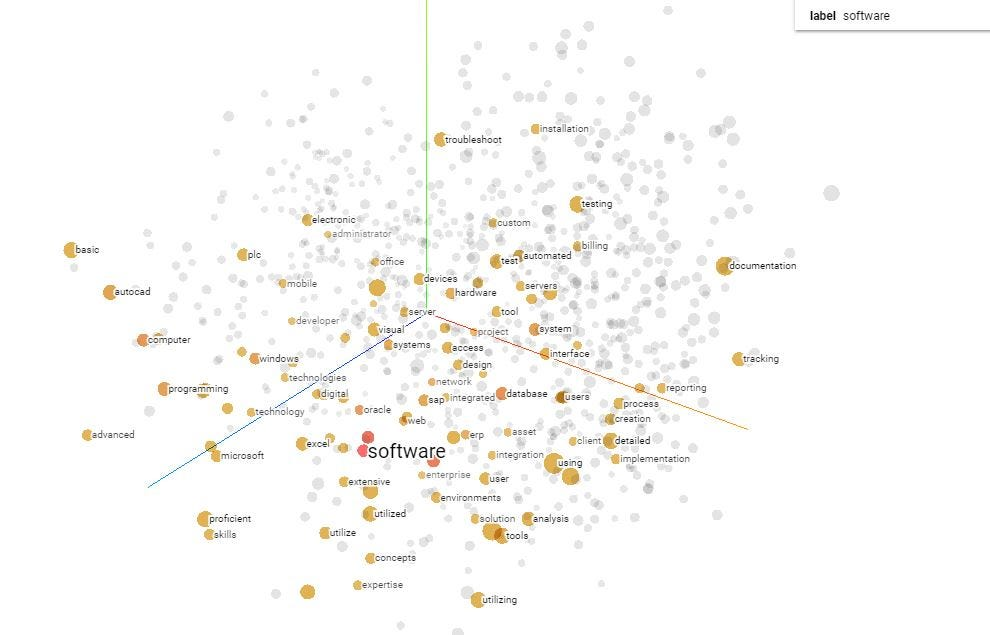
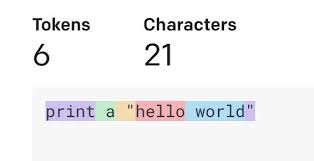
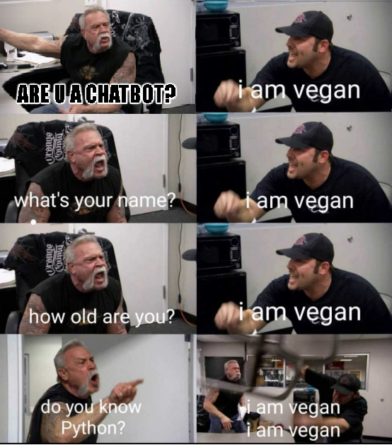

# Procesamiento del Lenguaje Natural - UBA

### Alumno:
Ernesto Rincon- eeng.rincon@gmail.com 

## Descripción General

Este proyecto incluye una colección de desafíos prácticos centrados en el procesamiento del lenguaje natural (NLP). Cada uno de ellos explora distintos aspectos de NLP, abarcando desde modelos de clasificación simples como similitud de cosenos y modelos de Naive Bayes hasta la construcción de modelos de lenguaje avanzados con técnicas como LSTM, GRU y BERT.

## Proyectos del Directorio

- ├── Desafio_1.ipynb
- ├── Desafio_2.ipynb
- ├── Desafio_3_word.ipynb
- ├── Desafio_3_char.ipynb
- ├── Desafio_4.ipynb
- └── Desafio_5.ipynb

## Descripción de los Archivos

## [Desafio 1](Desafio%201/): 

  - **Título**: Vectorización de texto y modelo de clasificación Naïve Bayes cprobado en el dataset 20 newsgroups
  - **Descripción**: Este jupyter notebook aborda la vectorización de texto mediante técnicas como TF-IDF y desarrolla un modelo de clasificación Naïve Bayes para categorizar textos del dataset 20 newsgroups.

## [Desafio 2](Desafio%202/):

  - **Título**: Custom embeddings con Gensim
  - **Descripción**: Se crean embeddings personalizados utilizando la biblioteca Gensim, examinando diversas maneras de representar palabras en un espacio vectorial.

## [Desafio 3](Desafio%203/):

## **Desafio_3_word.ipynb**:
  - **Título**: Modelo de lenguaje con tokenización por palabras
  - **Descripción**: Implementación de un modelo de lenguaje utilizando tokenización por palabras, entrenado para predecir la siguiente secuencia en una cadena de texto. Se deja modelo entrenado para ser comprobado.

## **Desafio_3_char.ipynb**:
  - **Título**: Modelo de lenguaje con tokenización por caracteres
  - **Descripción**: Este notebook aborda la creación de un modelo de lenguaje utilizando tokenización por caracteres, útil para tareas de predicción a nivel de carácter.

## [Desafio 4](Desafio%204/):

  - **Título**: LSTM Bot QA
  - **Descripción**: Creación de un modelo de chatbot de preguntas y respuestas utilizando redes neuronales LSTM dentro de una arquitectura de encoder-decoder, para manejar preguntas en lenguaje natural.

## [Desafio 5](Desafio%205/):

  - **Título**: Bert Sentiment Analysis
  - **Descripción**: Se utiliza el modelo BERT para realizar análisis de sentimientos en textos, aprovechando la capacidad de BERT para entender el contexto de las palabras en una frase.

